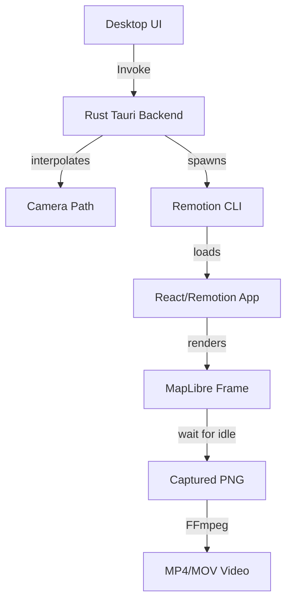

# Cinematic Map Architecture

This project implements a high-performance cinematic map rendering engine using **Tauri** for the desktop frontend and **Remotion** for frame-perfect video rendering.

## 🏗️ System Overview

The system is split into three main domains:

1.  **Map Engine (Rust)**: Handles high-precision camera interpolation and geodesic math.
2.  **UI Core (TypeScript)**: Shared React components and MapLibre logic used in both the Desktop app and the Renderer.
3.  **Remotion Renderer (Node.js)**: Orchestrates frame capture and video encoding.

## 🎞️ Rendering Pipeline

The transition from live preview to final render ensures visual consistency:

-   **Live Preview**: The Desktop UI calls the Rust engine via Tauri's `invoke` on every frame (interpolated live) to smoothly move the preview camera.
-   **Remotion Render**: 
    1.  The Rust backend computes *all* frames for the entire animation.
    2.  It passes these camera states as JSON props to the Remotion CLI.
    3.  Remotion's `calculateMetadata` dynamically sets the video duration.
    4.  The `Composition` component uses `delayRender` and MapLibre's `.isIdle()` to ensure tiles are fully loaded before capturing each frame.

## 🚀 Performance Optimizations

-   **Multi-Core Rendering**: The CLI detects CPU thread count and scales Remotion's concurrency automatically.
-   **Idle Detection**: Replaces fragile timeouts with deterministic state tracking (`isIdle`), preventing blurred frames or missing tiles.
-   **Cinematic Arc**: Custom geodesic interpolation that "lifts" the camera during long-distance travels for a more natural flyover effect.

## 🛠️ Development & Tooling

-   **Monorepo**: Managed with `pnpm` workspaces.
-   **Type Safety**: Shared types between Rust (`serde`) and TypeScript ensure strict communication.
-   **Linting**: Standardized workspace-wide linting via root scripts.
